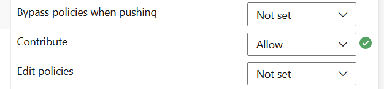

# Contribute from a pipeline

In an Azure DevOps pipeline, you can use the `<ProjectName> Build Service` [Service Account](https://learn.microsoft.com/en-us/azure/devops/organizations/security/permissions?view=azure-devops&tabs=preview-page#service-accounts) to checkout the repository and write changes back to the repository.

To do so there are two steps:

1. Checkout the code but **persist the credentials**

    ```yaml
    - checkout: self
      persistCredentials: true
      clean: true
    ```

2. Then either on the `main` branch or the repository level, in the `Security` Tab set the `Contribute` permission to `Allow` for `<ProjectName> Build Service`

    
