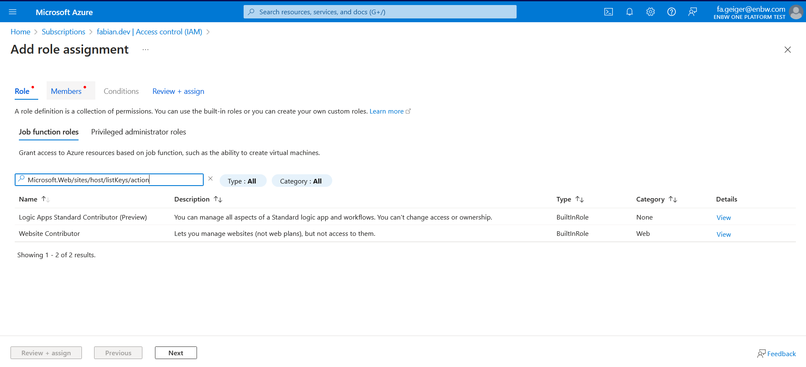

# Find permissions in RBAC roles easily

In your subscription, go to Access control (IAM), choose to add a role assignment (for this you be in an owner role on the subscription).

The "Add role assignment" pane shows. Paste the specific action in the search bar and the RBAC roles that have that action will be shown.

