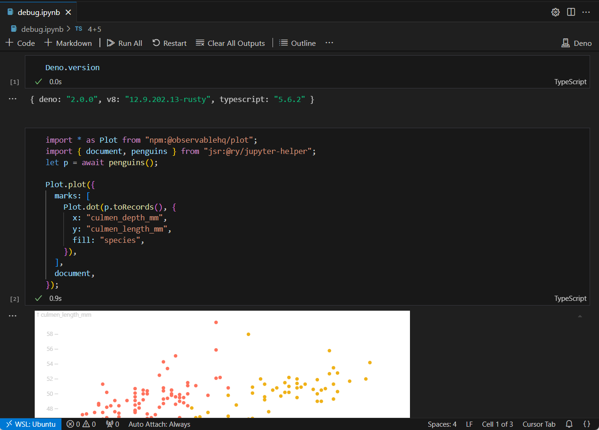

# Deno Jupyter

Deno ships with a Jupyter notebook kernel.

```bash
deno juptyer --install
```

That file is picked up by any Jupyter servers running on your machine, e.g. it can be used in VSCode to run arbitrary Deno code.


